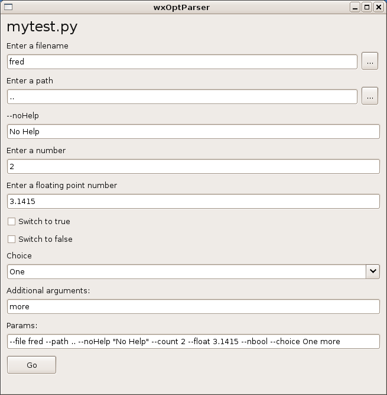

===========
wxOptParse
===========

.. meta::
   :keywords: wxOptParse, optparse, wxPython, python
   :description lang=en: Graphical front end to optparse enabled python programs.

''Don't limit yourself to only the command line.''

.. contents:: Table of Contents

Introduction
============

|wxoptparse| is a Python program that brings up a graphical representation of 
the options that another python program has for the command line, via the optparse
module.

What this means is that if if you have a program that uses optparse you can 
click on checkboxes, edit boxes, combo boxes, etc. instead of using the command line.

So instead of this::

    usage: mytest.py [options]
    
    options:
      -h, --help            show this help message and exit
      -f FILENAME, --file=FILENAME
                            Enter a filename
      -p PATH, --path=PATH  Enter a path
      -2 FILENAME2, --noHelp=FILENAME2
      -n NUMBER, --count=NUMBER
                            Enter a number
      -m FLOAT, --float=FLOAT
                            Enter a floating point number
      -b, --bool            Switch to true
      --nbool               Switch to false
      --choice=CHOICE       Choice

You get 

Features
========

* Cross-platform.  Should work on Windows, Linux, Unix, or Mac.

* Absolutely no changes required for the program you want to run.

* You can continue to use the program at the command line as well.

* Boolean flags shown as checkboxes.

* String options that use the word "file" add a file browser button.

* String options that use the work "path" or "folder" add a path browser button.

* Choices are shown as a combo box.

* Your most recently used choices are used by default.

* A history of your previous items are stored.

Dependencies
============

* wxPython 2.5.3 or greater.

* Python 2.4 (untested in 2.3).

Installing
==========

Egg
---

::

    easy_install.py wxoptparse

Linux
-----

::

    tar xvzf wxoptparse*.tar.gz
    cd wxoptparse*
    sudo python setup.py install

Running
=======

To Do
=====

* A way to *use* your recent items (combo box).

* A method to force an option's type (like whether it is to browse for file/folder)

* Be able to change these items through a GUI interface.

* Ability to reset the options to the defaults.

* Have wxOptParse eat it's own dog food (if possible).

* Ability to save a set of settings and give it a name.

* Skin the dialog box.

* Run the ouput in a sub window (I tried but wasn't able to do it).

Related Links
================

* ``configparse``: an optparse extension module for configuration file parsing. http://www.gustaebel.de/lars/configparse/

* My web blog: http://scottkirkwood.blogspot.com/

* My homepage (gathering cobwebs) http://forusers.com/

Changelog
=========

- Release 0.0.1 - Sept 6th, 2005

Initial working release.

.. _Subversion: http://subversion.tigris.org/

.. |wxoptparse| replace:: ``wxOptParse``

.. |Not supported| replace:: **- Not supported**